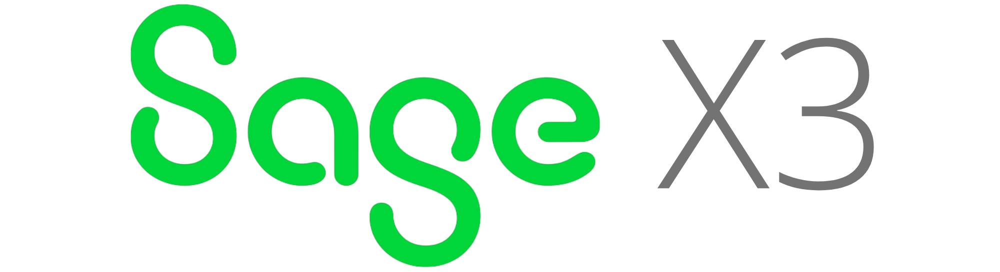

<h1 align="center">Hi there 👋, I'm Richard Ikeda</h1>
<h3 align="center">Solutions Architect & ERP Modernization Specialist</h3>

<h2>Overview & Value Proposition</h2>

My mission is to empower companies to streamline their business processes and achieve maximum efficiency through tailored software solutions. As the founder of <a href="https://enterscript.com/" target="_blank">Enter Script</a>, I specialize in the architecture, development, and integration of ERP systems, with a core focus on <b>SAGE X3.</b>

My technical expertise is global. I have worked on the implementation of complex solutions in several countries, including Portugal, Canada, Peru, Argentina, and Brazil, with a proven track record in developing robust APIs and applying regulatory requirements from different legislations in Latin America and international projects.

I possess a strong technical background in Internet Systems Technology, with continuous professional development in Mobile Applications and Cloud Computing. My expertise includes implementing complex ERP solutions, developing robust APIs, and applying legislations requirements in corporate environments.

<h2>Featured Projects & Contributions</h2>

🔭 No X3 Language Plugin (In development): A project I developed to enhance the programming experience in Sage X3, improving developer productivity and code quality. <a href="https://github.com/richardikeda/nox3-language-plugin" target="_blank">[View Project]</a>

<h2>Core Skills & Tools</h2>

 

<h2>Continuous Growth & Learning</h2>

🌱 Currently Learning: Kotlin, React, and Unity, with a focus on how these technologies can modernize and extend the functionality of legacy and ERP systems.

📝 Content Creation: I regularly write articles about technology and business solutions on my company site. <a href="https://enterscript.com" target="_blank">[enterscript.com]</a>

<h2>Let's Connect & Collaborate</h2>

I'm always open to collaboration opportunities, discussions about new technologies, and strategic partnerships.

	
	
	
	<!--a href="https://fb.com/richardikeda" target="blank"></a-->
	
	<!--a href="https://www.youtube.com/c/richardikeda" target="blank"></a-->
<h3>Contact</h3>
- 📫 How to reach me **richard@enterscript.com**

<h2>My GitHub Performance</h2>

<h2>For fun</h2>

  <!--div>
&nbsp; 

  
</div-->
